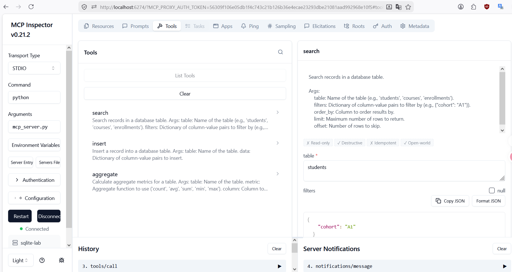
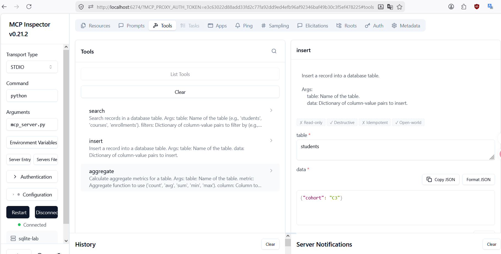
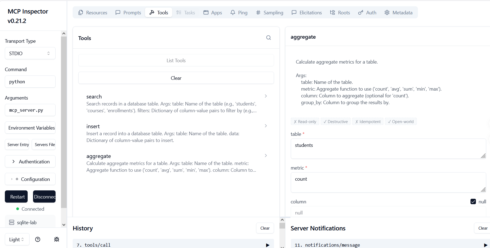

# MCP Database Server (SQLite + FastMCP)

This is an implementation of a Model Context Protocol (MCP) server that exposes a simple SQLite database via `FastMCP`.

## Project Structure

```text
implementation/
  db.py                # Database connection, validation, and queries
  init_db.py           # Script to initialize the lab.db SQLite database
  mcp_server.py        # FastMCP server exposing tools and resources
  verify_server.py     # Script to manually test the server's Python functions
  tests/
    test_server.py     # Automated unit tests using unittest
```

## Setup Instructions

1. **Install Dependencies**:
   Ensure you have Python 3.10+ installed. Install the `mcp` SDK:
   ```bash
   pip install mcp
   ```

2. **Initialize Database**:
   Navigate to the `implementation` folder and initialize the database. This will create a `lab.db` file with seed data:
   ```bash
   cd implementation
   python init_db.py
   ```

3. **Verify the Server**:
   You can manually run a local verification script to check that functions are returning correct schemas and query results:
   ```bash
   python verify_server.py
   ```
   Or run the automated tests:
   ```bash
   python -m unittest tests/test_server.py
   ```

## Client Configuration Example

### Claude Code (`.mcp.json`)
Create an `.mcp.json` file in your working directory:
```json
{
  "mcpServers": {
    "sqlite-lab": {
      "type": "stdio",
      "command": "python",
      "args": ["/ABSOLUTE/PATH/TO/implementation/mcp_server.py"],
      "env": {}
    }
  }
}
```

### Gemini CLI / Antigravity (`mcp_config.json`)
```json
{
  "mcpServers": {
    "sqlite-lab": {
      "command": "python",
      "args": ["/ABSOLUTE/PATH/TO/implementation/mcp_server.py"],
      "cwd": "/ABSOLUTE/PATH/TO/implementation"
    }
  }
}
```

### MCP Inspector
Test via the standard MCP inspector:
```bash
npx -y @modelcontextprotocol/inspector python /ABSOLUTE/PATH/TO/implementation/mcp_server.py
```

## Tools Available
1. **`search`**: Search records with optional filters, ordering, and pagination.
2. **`insert`**: Insert a record into a specified table and returns the generated row data.
3. **`aggregate`**: Perform standard aggregations such as `count`, `avg`, `sum`, `min`, `max`.

## Resources
1. **`schema://database`**: Exposes the full database schema as JSON.
2. **`schema://table/{table_name}`**: Dynamic resource that displays schema for a specific table.

## Safety and Validation
- Reject unknown tables and columns.
- Prevent invalid aggregate operations.
- Avoid raw SQL concatenation; use parameterized queries for all database interaction.

## Demonstration

Here are screenshots of the MCP Server in action using the MCP Inspector:

### 1. Search Tool


### 2. Insert Tool (Error Handling)


### 3. Aggregate Tool
